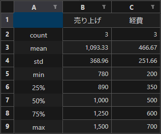
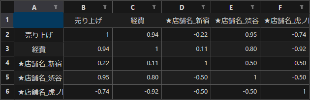
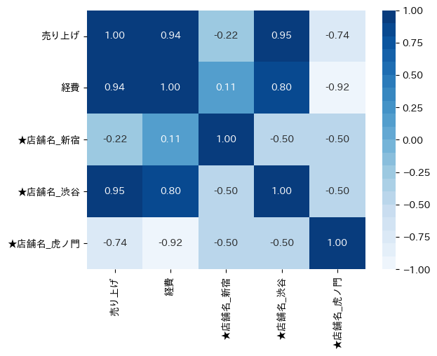

# 処理概要

手元にあるエクセルのデータなどから基本統計量と相関係数を出力する

## 処理内容

* TSVファイルを読み込む
* ★から始まる列名のデータをダミー変数化する
* 基本統計量と相関関数を外部ファイルに出力する

## 入力データ

### input.tsv

* エクセルなどからコピーして作ったTSVファイルを使用することを想定したサンプルデータ
* 列名の先頭に「★」をつけた列はダミー変数化処理の対象となる
  * テキストデータをそのまま処理することができないため、事前処理対象の目印としている

| ★店舗名 | 売り上げ | 経費 |
| ------- | -------- | ---- |
| 新宿    | 1000     | 500  |
| 渋谷    | 1500     | 700  |
| 虎ノ門  | 780      | 200  |

## 出力データ

### 下記の3ファイルが出力される

* 基本統計量.xlsx

  

* 相関係数.xlsx

  

* 相関係数.png

  